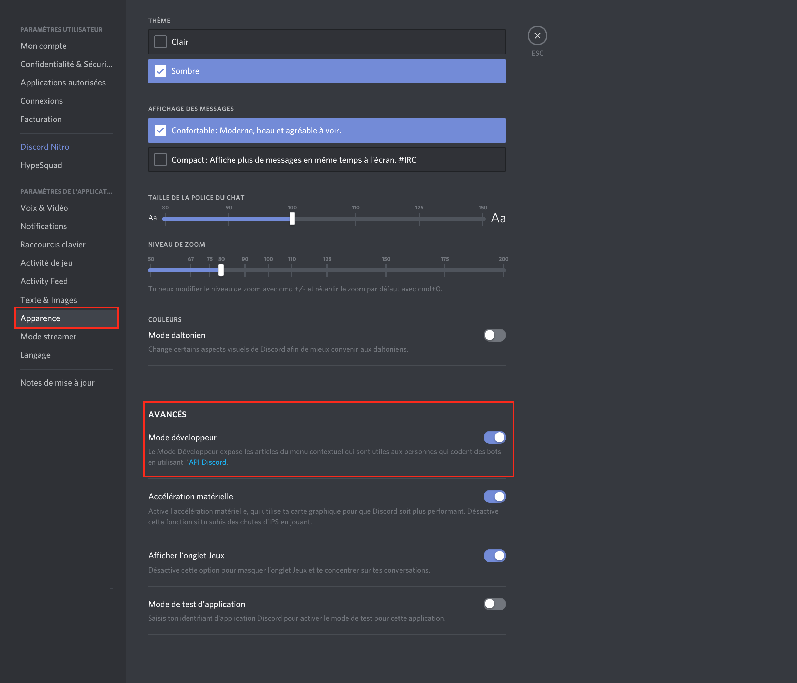
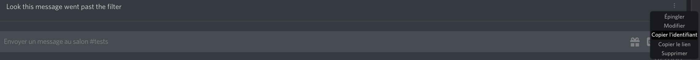

# Report spambots that get past the filter

### Double-check that filters are activated

Run the simple `+doctor` command and check that `AutoInspect` is enabled and that `AutoMod` and `AutoTriggers` are also green.


 If you can, please use the web interface to ensure that specific `AutoInspect`and `AutoTriggers` are also activated. 


### Enable Developer mode

If you haven't already, in your Discord client settings, under Appearance, enable the Developer Mode.

### Get the message ID

Select a message that got past the filter. You should see three points at the end of the message if you are on a computer. On a phone, long press the message.

Select Copy \(Message\) ID to copy the ID to the clipboard.

### Get message information

Use the command `+message_info [the message ID you copied]` to ask the bot for logs and information about the message. Take a screenshot of the message sent by the bot.

### Send your report

Send your screenshot and some explanation on what was wrong on the \#support channel on the [Support Server](https://discord.gg/Qr59gMH).

