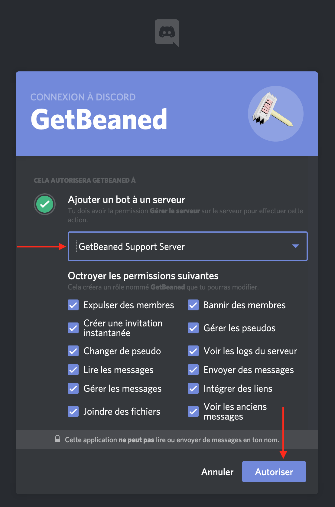
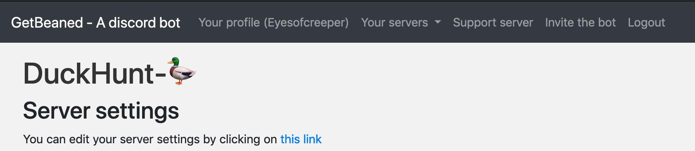
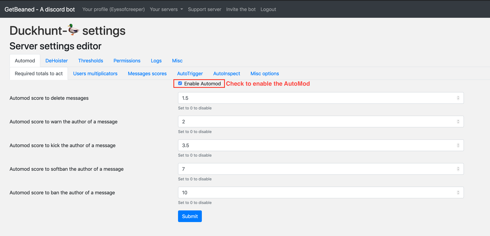
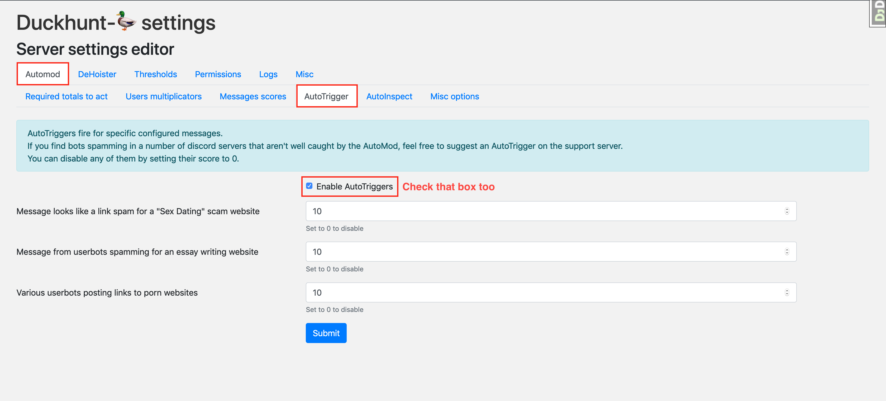

# QuickStart: Setting up GetBeaned on your server

### Adding GetBeaned to your server

First, we'll have to add GetBeaned to your server.&#x20;

#### Inviting the bot

Please click the following link to add [GetBeaned to your server](https://discordapp.com/oauth2/authorize?client\_id=492797767916191745\&permissions=201714887\&scope=bot).


Only server admins (`Administrators`) can add bots to a server. If you don't see your server in the list, please double-check that you are logged on the right discord account


Select your server in the list and click the Authorise button

#### Moving the bot role higher in the list

Return to the discord application. Click on your server name to open the server settings. Under roles, select the GetBeaned role and move it to the top.


The bot role needs to be higher than the top user role if you want GetBeaned to be able to kick or ban them.

You don't have to place GetBeaned higher than admins.


Click on the green `Save` button, then return to the chat.

#### Verify that the permissions are valid

Use the `+doctor`command somewhere on the server and pay attention to the`Bot Permissions` embed.


If it's red, it means that the bot has some permissions problems on some of the channels. Please check that GetBeaned has the necessary permissions in channels that you want to protect.

However, you don't have to give GetBeaned permissions to restricted channels where only trusted users can speak.


### Setup the bot to moderate the server

#### Permissions

First, add yourself as a [server admin](../bot-documentation/levels-and-permissions.md). Use the `+add_admin @your_discord_name`command to be able to edit settings on the web interface.

If you have moderators, you can add them all using the command `+add_moderator [a role ID]`to give them moderation permissions on the bot.

#### Enable the Auto-functions

On discord, type `+urls`to get a direct link to your server webpage. If you aren't logged in on the website, do that by clicking the "Login" button on the top bar.



The automod is already configured. You just have to enable it by clicking the box near Enable AutoMod




If your server is targeted by spam bots, or you have/plan to have public invites, enable the AutoTriggers for maximum protection.




You want to kick accouns that are gonna spam your server even before they start ? **GetBeaned** can do that too! Enable AutoInspect to protect yourself from spam of known bad user bots. Turn on each type of but you want to be protected of by selecting the correct thing for the bot to do : warn admins, kick or ban the user.


To use AutoInspect, you'll need to setup the logs on your server too. This is described in detail over the Enable Logging page. \
\
Tl;Dr: Get the channel ID of a channel you want to log in (`+channel_id`can help you), and copy/paste it in the Logs settings page under **AutoInspect logs**. Don't forget to enable logs with the checkbox too. ****&#x20;




#### Thresholds

Check the box to enable **thresholds**. This will make Getbeaned kick/ban repeat offenders without action from your mod staff

#### DeHoister

Are you tired of users adding a `!`to thier name to appear at the top at the user list ? If that sounds like a problem for you, wait no more and enable the **DeHoister** to remove these pesky ! from users nicknames.



Click the `Submit`button to save your settings.

#### Quick check

Return to your discord server and type `+doctor` to be sure that everything is now correctly setup.

### Done!

You've finished this tutorial. Your server is now protected by **GetBeaned**. For more info, please join the [support server](https://discord.gg/CnmwaZB).
