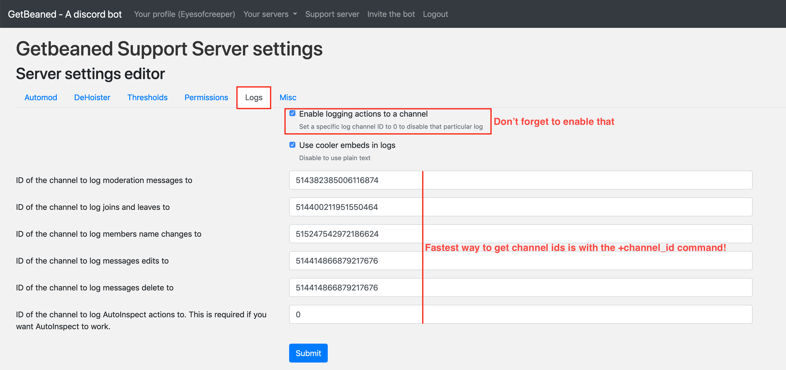

# Setting up logging

### How does logging works ?

Logging events is done by a specific component of GetBeaned. Every time discord notifies the bot, a special embed is crafted for your enabled logging channels and sent to the right channel. The bot uses informations it can retrive from discord \(authors, IDs, ...\) and informations it downloaded previously.

### What can be logged ?

* Moderation actions \(`+ban`, `+kick`,`+warn`,`+mute`,`+note`,...\)
* People joining and leaving the server
* Nicknames changes and username changes
* Messages edits\*
* Message deletions\*
* AutoInspect actions


\* Only some editions and deletions can be logged due to technical limitations.


### How to configure logging ?

#### Step 1: Create your channel to log messages on

On the discord client, create a new channel called `#mod-log`\(or anything else really, but we will use \#mod-log for this example\)

Double-check that GetBeaned and moderators are the only groups allowed to write and embed links in that channel.

Now, type `+channel_id`to get the channel ID and copy it to your clipboard

#### Step 2: Enable logging

On your server settings page \(`+urls`to get the url of the page\), go the the `Logs` tab and paste the channel ID on the log\(s\) you want GetBeaned to post on that channel

#### Step 3: Check that everything is okay

Back on discord, use the `+doctor`command to double-check that logging channels are setup correctly!

#### Congratulations

You have sucessfully setup logging on your server.

